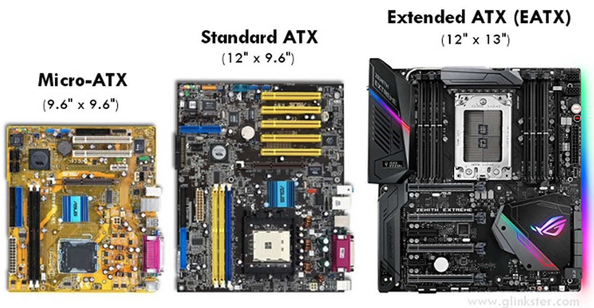
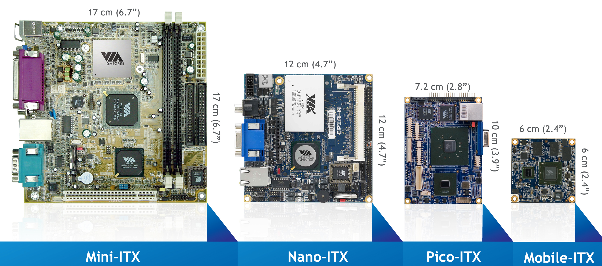
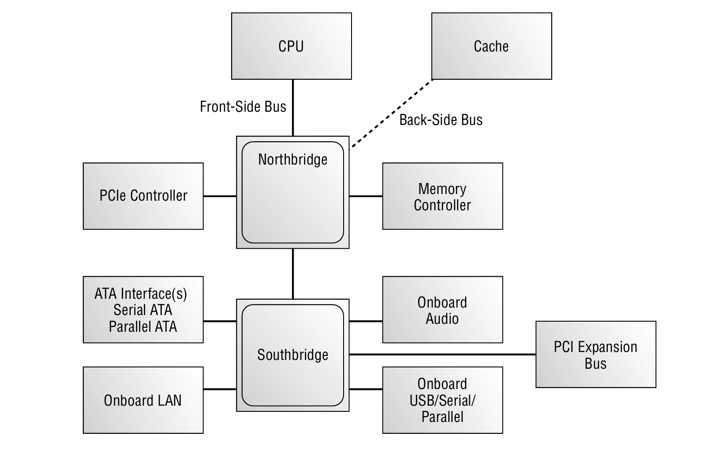
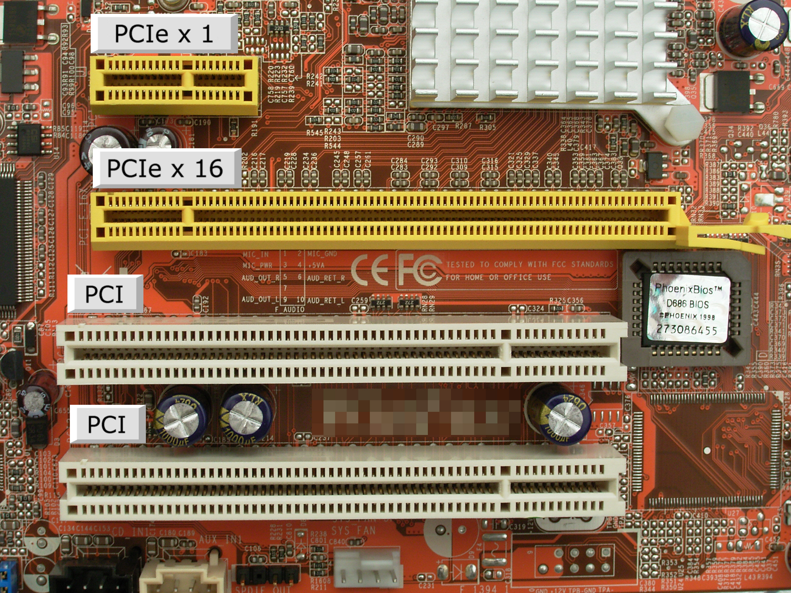

### 🧩 Understanding Motherboards
- [📏 Motherboard Form Factors](#motherboard-form-factors)
- [🧃 System Board Components](#system-board-components)

### 🧠 Understanding Processors
- [🏗️ CPU Architecture](#cpu-architecture)
- [⚙️ CPU Characteristics](#cpu-characteristics)

### 💾 Understanding Memory
- [📘 Important Memory Terms](#important-memory-terms)
- [📚 Types of Memory](#types-of-memory)
- [📦 Memory Packaging](#memory-packaging)

### 🌬️ Understanding Cooling Systems
- [🌀 Fans](#fans)
- [❄️ Memory Cooling](#memory-cooling)
- [💽 Hard Drive Cooling](#hard-drive-cooling)
- [🔥 Chipset Cooling](#chipset-cooling)
- [🧊 CPU Cooling](#cpu-cooling)

---

## 🧩 Understanding Motherboards

The **motherboard** is the main circuit board of a computer — often called the **system board** or **mainboard**. It serves as the central hub, connecting all components together: CPU, RAM, storage, expansion cards, and more.

- 🧵 A **PCB (Printed Circuit Board)** with conductive pathways and a non-conductive substrate.
- 🎨 Common colors: green, black, red, blue, and brown.
- 🧠 Hosts essential parts like:
  - CPU socket or embedded CPU
  - RAM slots
  - Expansion slots (PCIe, PCI)
  - Chipsets and other integrated components

### 📏 Motherboard Form Factors

Form factors define the **size**, **shape**, and **mounting compatibility** of motherboards. Choosing the correct one is critical for hardware compatibility and case fitting.

#### 🧱 ATX (Advanced Technology eXtended)  
Developed by **Intel** in the mid-1990s, ATX is the **mainstream motherboard form factor** designed for full-size desktop systems. It offers high compatibility, expandability, and cooling efficiency.

ATX and its variants are commonly used in:
- 🖥️ General-purpose desktop PCs  
- 🧑‍💻 Workstations and high-performance setups  
- 🕹️ Gaming and multi-GPU systems

##### 🧾 ATX Form Factor Comparison

| Form Factor          | Dimensions (inches) | Dimensions (mm)     | Typical Use                                      |
|----------------------|---------------------|----------------------|--------------------------------------------------|
| Standard ATX       | 12" × 9.6"          | 305 × 244            | Full-featured desktops & gaming systems          |
| Micro-ATX          | 9.6" × 9.6"         | 244 × 244            | Budget builds, fewer slots, compact ATX cases    |
| Extended ATX (E-ATX)| 12" × 13"          | 305 × 330            | High-end systems with multiple GPUs, workstations|

- ✅ **Micro-ATX** fits in **ATX cases**, offering flexibility in compact builds.
- ❌ **E-ATX** requires larger **full tower cases** due to extra width.
X

#### 🧬 ITX (Information Technology eXtended)
Developed by **VIA Technologies** in early 2000s for **small form factor (SFF)** systems. ITX is a family of compact, low-power boards often used in:
- 🎮 Compact desktops & gaming PCs
- 📺 Home-theater PCs (HTPCs)
- 🔌 Embedded systems (e.g. set-top boxes)

##### 🧾 ITX Form Factor Comparison

| Form Factor   | Dimensions (inches) | Dimensions (mm) | Typical Use                           |
|---------------|---------------------|------------------|----------------------------------------|
| Mini-ITX   | 6.7" × 6.7"         | 170 × 170        | SFF desktops, HTPCs                    |
| Nano-ITX   | 4.7" × 4.7"         | 120 × 120        | Embedded systems                       |
| Pico-ITX   | 3.9" × 2.8"         | 100 × 72         | Industrial & embedded applications     |
| Mobile-ITX | 2.4" × 2.4"         | 60 × 60          | Ultra-compact, mobile & IoT devices    |

- ✅ **Mini-ITX** is compatible with some **ATX** cases.
- ❌ Other ITX variants (Nano/Pico/Mobile) are not physically compatible with ATX standards.

🔧 **Note**: When choosing a motherboard, make sure all other components (CPU, RAM, case, PSU) are compatible with the selected form factor.

---

### 🧃 System Board Components

- [🚌 Bus Architecture](#bus-architecture)
- [🧠 Chipsets](#chipsets)
- [🔌 Expansion Slots](#expansion-slots)
- [💾 Memory Slots and Cache](#memory-slots-and-cache)
- [⚙️ CPUs and Processor Sockets](#cpus-and-processor-sockets)
- [🔋 Power Connectors](#power-connectors)
- [💽 Storage Connectors (Non-Volatile)](#storage-connectors-non-volatile)
- [🧵 Motherboard Headers](#motherboard-headers)
- [🧬 BIOS / UEFI / Firmware](#bios--uefi--firmware)
- [🔧 CMOS and CMOS Battery](#cmos-and-cmos-battery)

#### 🚌 Bus Architecture

In computers, a **bus** is a set of signal pathways used for data transmission between components.

##### 🚍 Evolution of Bus Types

| Bus Type        | Description                                                                 |
|------------------|-----------------------------------------------------------------------------|
| **Parallel Bus** | Sends multiple bits at once (e.g., 8-bit in early PCs). Fast but limited by **distance** and **signal synchronization**. |
| **Serial Bus**   | Sends one bit at a time but at very high speed. Now **dominates modern systems** due to better scalability and performance. |

🔧 **Modern Serial Bus Standards:**
- 💽 **SATA** (Serial ATA) – storage devices  
- 🔌 **USB** – universal connectivity  
- 🔥 **IEEE 1394** (FireWire) – older multimedia connections  
- 🚀 **PCIe** – high-speed expansion slots for GPUs, SSDs, etc.

##### 🧩 Buses on a Motherboard

- 🔗 **Internal Buses**: Connect CPU, RAM, and chipset internally.
- 📥 **Expansion Buses**: Allow plug-in cards via slots (e.g., PCIe).
- ⚙️ **System Bus**: Often refers to the main data channel between CPU and RAM.

##### 🕒 Bus Speed

- **Measured in MHz or GT/s (GigaTransfers/second)**
- Higher speed = better performance  
- Some buses are **synchronized** with each other (e.g., CPU bus and system bus)

> ⚠️ **Note**: Most modern systems use serial buses due to superior speed, distance handling, and ease of design compared to parallel buses.

---

#### 🧠 Chipsets

A **chipset** is a group of integrated circuits on the motherboard that manage data flow between the processor, memory, and peripherals. It largely determines motherboard capabilities and supported components.

##### 🔧 Common Chipset Responsibilities:
- 🧬 Interface with **CPU** and **RAM**
- 🎮 Support for **graphics cards** and **PCIe devices**
- 📦 Communication with **storage**, **USB**, and **legacy ports**

##### 🧩 Chipset Manufacturers & Models
Chipsets are typically named by vendors like **Intel** and **AMD** (e.g., `Z790`, `B550`, `X570`). Each supports specific features and processors.

##### 🧭 Two Main Chipset Components

| Component     | Role                                                                 |
|---------------|----------------------------------------------------------------------|
| **Northbridge** | Manages high-speed devices like CPU ↔ RAM and PCIe graphics.        |
| **Southbridge** | Controls slower devices like SATA, USB, PCI, and onboard audio/network.|

##### 🧭 Northbridge (Now Often Integrated into CPU)
- 📶 Connects CPU ↔ Memory over **Front-Side Bus (FSB)**
- 🎮 Manages **integrated video** and **PCIe slots**
- 🔁 Connects to Southbridge for further communication

🧠 **Note:** In modern CPUs, Northbridge functionality is often moved into the processor itself.

##### 🧲 Southbridge
- 🧵 Handles **USB**, **SATA**, **PCI**, legacy ports (serial/parallel)
- 🎧 Manages **onboard audio/network**
- 📡 Interfaces with **slower expansion buses**

📘 *Modern chipsets are often cooled with heatsinks and may be difficult to visually identify—check documentation for exact specs.*

##### 🧱 Expansion Slots

Expansion slots allow users to **install additional hardware components** into the motherboard to enhance or expand system functionality.

🔌 **Common Expansion Devices:**
- 🎮 Graphics cards
- 🌐 Network cards
- 🔊 Sound cards
- 💾 Storage controllers

---

#### 🔌 Expansion Slots

Although now legacy, **PCI** was a widely used parallel expansion interface from the 1990s.

| Attribute               | Details                                                                 |
|------------------------|-------------------------------------------------------------------------|
| 🏷️ Type                 | Parallel, shared-bus                                                    |
| ⚙️ Bus Width            | 32-bit (most common), 64-bit (servers)                                 |
| 🚀 Speed                | 33 MHz → 133 MBps or 66 MHz → 266 MBps                                 |
| 🔌 Voltage Versions     | 3.3V and 5V (notch positions indicate type)                             |
| 🔄 Compatibility        | Universal cards support both voltages                                   |

📏 PCI slots are about **3 inches long**, typically white, and can still be found in some modern boards for legacy device support.

##### 🚀 PCI Express (PCIe)

The modern standard for high-speed expansion. Replaces both **PCI** and **AGP**.

| Attribute        | Details                                                                           |
|------------------|-----------------------------------------------------------------------------------|
| 📡 Type           | Point-to-point serial (switch-based, not shared)                                 |
| 🧱 Topology        | Star-like (not a true bus)                                                       |
| ↔️ Lane Concept    | Full-duplex lanes (x1, x4, x8, x16, x32)                                          |
| 💨 Speed per Lane | PCIe 1.x → 250 MBps, PCIe 2.x → 500 MBps, PCIe 3.0 → 1 GBps, PCIe 4.0 → 2 GBps    |
| ⚡ Max Throughput  | PCIe 1.x x16 = 8 GBps (bidirectional), PCIe 5.0 x16 = ~128 GBps                   |

🧩 Each **slot's length** depends on lane width (x1, x4, x8, x16, etc.). All slots include a **22-pin power section** at the rear.

##### 🎮 PCIe and Gaming

🔗 **NVIDIA SLI** (Scalable Link Interface) allows:
- Combining multiple **PCIe x16 graphics cards**
- Improved GPU performance using bridge connectors
- Support for 2–4 GPUs in **SLI-ready motherboards**

🔧 Cards are secured with latches and tabs to prevent disconnection due to vibrations or movement.

💡 *PCIe remains the dominant expansion interface for high-performance and gaming systems.*

---

#### 💾 Memory Slots and Cache

##### 📌 Memory Slots (RAM)

- **Function**: Hold RAM modules that store data and instructions currently used by the CPU.
- **Form Factor**:
  - **DIMM** – used in desktops.
  - **SODIMM / MicroDIMM** – used in laptops.
- **Common Pin Configurations**: 168, 184, 240, 288.
- **Slot Design**:
  - Slots are color-coded for channel guidance (single, dual, etc.).
  - Tabs on each side secure the memory module.

##### 🗃️ Virtual Memory

- **Purpose**: Acts as backup RAM using hard disk space when physical RAM is full.
- **File Used**: `PAGEFILE.SYS` (default location: `C:\pagefile.sys`)
- **Downside**: Slower performance – better to upgrade physical RAM.

##### ⚡ Cache Memory

- **Role**: Extremely fast memory between CPU and RAM.
- **Type**: Static RAM (SRAM).
- **Function**: Predicts and preloads what the CPU might need next.

###### 🔢 Cache Levels

| Level | Speed      | Size      | Location       | Notes                            |
|-------|------------|-----------|----------------|----------------------------------|
| L1    | Fastest    | ~80 KB    | On CPU die     | Split for instructions & data    |
| L2    | Fast       | ~512 KB   | On CPU die     | Dedicated per core (mostly)      |
| L3    | Slower     | 8–16 MB   | On CPU die     | Shared among all CPU cores       |

##### 🧮 Memory Hierarchy (Speed & Capacity)

1. **L1 Cache** – Fastest, smallest (~80 KB)
2. **L2 Cache** – Fast, small (~512 KB)
3. **L3 Cache** – Slower, larger (8–16 MB)
4. **RAM** – Much larger (16–256 GB)
5. **HDD/SSD** – Largest, slowest (100s of GB to TBs)

---

#### ⚙️ CPUs and Processor Sockets

##### 🔍 Central Processing Unit (CPU)

- **Main Role**: The "brain" of the computer that executes instructions.
- **Appearance**: Usually under a **fan or heat sink** on the motherboard.
- **Heat Dissipation**: Critical to prevent overheating and permanent damage.

##### 🧩 Processor Sockets

- **Purpose**: Holds and connects the CPU to the motherboard.
- **Types**:
  - **PGA (Pin Grid Array)**:
    - CPU has pins; socket has holes.
    - Example: **Socket AM4** (AMD).
  - **LGA (Land Grid Array)**:
    - CPU has flat contacts (lands); socket has spring-loaded pins.
    - Example: **LGA 1200** (Intel).

##### 🔧 Socket Locking Mechanisms

- **ZIF (Zero Insertion Force)** – used with PGA:
  - Plastic/metal lever locks or releases the CPU.
- **LGA Locking**:
  - Uses a hinged metal lid secured with an L-shaped arm.

##### 🔄 Compatibility Notes

- **CPU ↔ Motherboard Compatibility**:
  - Intel CPUs only fit Intel-compatible sockets.
  - AMD CPUs only fit AMD-compatible sockets.
  - Even within a brand (e.g., Intel), socket compatibility may vary (e.g., LGA 1151 ≠ LGA 1200).

##### 🖥️ Multisocket & Server Motherboards

- **Multisocket Boards**:
  - Have 2+ CPU sockets.
  - Often used in servers for high-performance tasks.
  - Each CPU may have its own dedicated RAM slots.
- **Server Boards**:
  - May be **ATX-sized** or **custom**.
  - Support multiple processors, more memory, and more network interfaces.

##### 💻 Mobile (Laptop) Motherboards

- **Form Factor**: Custom-designed for specific laptop cases.
- **CPU Replacement**:
  - CPUs are often **soldered onto the motherboard**.
  - If CPU fails, usually the **entire motherboard must be replaced**.

---

#### 🔋 Power Connectors

##### 🔌 Motherboard Power Connection

- **Main Connector**: A **24-pin white block** on the motherboard.
- **Purpose**: Supplies power from the **power supply unit (PSU)** to the motherboard.
- **Standard**: This is the **ATX power connector**.

##### ⚡ Additional Power Connectors

Besides the main 24-pin connector, modern motherboards may include:

###### 1.4-pin / 8-pin CPU Power Connector
- Located near the CPU socket.
- Delivers **dedicated power** to the CPU.
- Labeled as `ATX12V` or `EPS12V`.

###### 2.PCIe Power Connectors
- Used to power high-performance **graphics cards (GPUs)**.
- Typically **6-pin or 8-pin** connectors.
- Supplied directly from the PSU, **not via the motherboard**.

###### 3.SATA Power Connectors
- Power connectors for **storage devices** like SSDs and HDDs.
- Connected directly from PSU to the device, not to the motherboard.

###### 4.Molex Connectors (Legacy)
- Older 4-pin connectors.
- Used for case fans, older drives, and some peripherals.

---

#### 💽 Storage Connectors (Non-Volatile)

Nonvolatile storage refers to storage devices that retain data even when the system is powered off. These storage devices connect to the motherboard through specific onboard connectors.

##### 🧩 1. Parallel ATA (PATA / IDE) – Legacy

- **Name**: Integrated Drive Electronics (IDE), now known as **PATA**.
- **Usage**: Used for older hard drives, optical drives, and tape drives.
- **Connector**: 40-pin ribbon cable interface.
- **Keying**: One pin is missing in the middle to ensure correct orientation.
- **Status**: Now considered **legacy** and replaced by SATA.

##### ⚡ 2. Serial ATA (SATA)

- **Successor** to PATA; uses serial data transfer instead of parallel.
- **Data Encoding**: Uses **8b/10b encoding**, resulting in ~20% bandwidth loss.
- **Key Features**:
  - Smaller, easier to manage cables.
  - Supports **hot swapping**.
  - Backward compatible.

| Version        | Nickname   | Transfer Rate | Real Bandwidth (MBps) |
|----------------|------------|---------------|------------------------|
| SATA 1.5 Gbps  | SATA I / 150 | 1.5 Gbps      | ~150 MBps              |
| SATA 3.0 Gbps  | SATA II / 300 | 3.0 Gbps     | ~300 MBps              |
| SATA 6.0 Gbps  | SATA III / 600 | 6.0 Gbps    | ~600 MBps              |

- **SATA Headers**: Typically 4–6 on modern motherboards.
- **Identifiers**: Labeled numerically on the motherboard (e.g., SATA_1, SATA_2), not related to speed version.

##### 🔌 3. eSATA (External SATA)

- Designed for **external** SATA drives.
- Offers the **same performance** as internal SATA (e.g., 6 Gbps = 600 MBps).
- Can be built-in or added via **expansion card**.
- Not hot-swappable by default; depends on implementation.

##### 🚀 4. M.2 (Form Factor)

- **Modern interface** for high-speed storage and expansion cards.
- **Used for**:
  - NVMe SSDs
  - SATA SSDs
  - Wi-Fi/Bluetooth modules
  - GPS and NFC modules
- **Important**: M.2 is a **form factor**, not a protocol.

###### 🔧 M.2 Supports Multiple Buses:

| Bus Type | Protocol | Example Usage       |
|----------|----------|---------------------|
| SATA     | AHCI     | Budget SSDs         |
| PCIe     | NVMe     | High-performance SSDs |
| USB      | USB 3.x  | Wireless modules    |

- **Slot Variants**: M.2 connectors vary in length and keying (e.g., **M key**, **B key**, **M+B key**).
- **Performance**: PCIe-based M.2 drives (NVMe) are significantly faster than SATA drives.

| Connector | Legacy? | Max Speed      | Hot Swap | Usage                    |
|-----------|---------|----------------|----------|---------------------------|
| PATA/IDE  | ✅ Yes   | ~133 MBps      | ❌ No     | Legacy drives             |
| SATA      | ❌ No    | Up to 600 MBps | ✅ Yes    | HDDs, SSDs, Optical       |
| eSATA     | ❌ No    | Up to 600 MBps | ⚠️ Optional | External storage          |
| M.2       | ❌ No    | Up to 7+ GBps  | ❌ No     | NVMe SSD, Wi-Fi, etc.     |

- Always verify **bus compatibility** (SATA vs. PCIe) when installing M.2 devices.
- For best performance, use **NVMe PCIe SSDs** over SATA SSDs.
- Avoid using PATA unless dealing with **legacy systems**.

---

#### 🧩 🧵 Motherboard Headers

Motherboard headers are groups of pins that allow **external case components** (like buttons, LEDs, audio jacks, and USB ports) to connect to the motherboard. These headers bring usability features like **power control, reset functions, and I/O ports** to the **front/top of the PC case**.

##### 📌 Common Header Types

| Header Type         | Function                                               |
|---------------------|--------------------------------------------------------|
| 🔘 Power Button      | Turns system on/off via motherboard relay              |
| 💡 Power LED         | Shows system is on (typically green)                   |
| 🔄 Reset Button      | Reboots the PC without powering off                    |
| 💽 Drive Activity LED| Indicates read/write activity across internal drives   |
| 🔊 Audio Jack Header | Connects front-panel headphone/microphone ports        |
| 🔌 USB Header        | Connects front-panel USB ports (for flash drives, etc.)|

##### 🖲️ Power Button & Power Light

- Located on the **front/top** of the case.
- Uses a motherboard contact to relay soft power features.
- Button behavior (e.g., press and hold to shut down) is configurable via **BIOS/UEFI or OS**.
- Power light typically uses a **green LED** for status confirmation.

##### 🔁 Reset Button

- Reboots the system at the **hardware level** without cutting power.
- Prevents wear from frequent power cycling.
- Useful for overcoming **system freezes** or software crashes.
- Does **not guarantee memory is cleared**, so may not fix all reboot issues.

##### 💡 Drive Activity Light

- **One LED** usually represents all internal drives.
- LED lights up during any drive activity (OS, swap files, etc.).
- Connected via header pins; once driven by the HDD itself, now handled by the **motherboard**.
- ❗ External drives (e.g., CD/DVD) typically have their own indicator lights.

##### 🎧 Audio Header (AC'97 vs HD Audio)

- Found on modern motherboards: **10-pin layout**, usually with one pin missing (key).
- Supports connection to **front-panel 3.5mm headphone/mic jacks**.
- Two standards:
  - **AC’97** (legacy, analog)
  - **HD Audio** (modern, digital, better signal quality)
- **BIOS setting** lets you choose which type to use (usually defaults to HD Audio).

##### 🔌 USB Headers (Front-Panel)

- Enables USB access from the **front/top panel** of the case.
- Uses a **10-pin block**, often with only 9 physical pins (1 missing as a key).
- Example labels: **USB56, USB78** → Represent USB port pairs (5&6, 7&8).
- Prevents wrong connections by using **keyed layouts** (pin positioning).

##### 🧠 Practical Notes

- Headers are sometimes **scattered** across the motherboard – careful reading of labels or consulting the **motherboard manual** is essential.
- Silkscreen labels on the motherboard **identify header purposes**, but **not always the pinout**.
- Consult the **motherboard documentation or website** for detailed diagrams.
- Incorrect header connections can result in **non-functioning ports or buttons**, so double-check alignment.

---

#### 🧬 BIOS / UEFI / Firmware

##### 🔧 Firmware Overview
- **Firmware**: Software embedded in hardware (ROM), independent of the OS.
- Found in PCs, printers, and other embedded systems.
- Example: BIOS, firmware on expansion cards (e.g., SCSI, GPU).

##### 🧠 BIOS (Basic Input/Output System)
- Stored in a ROM chip on the motherboard (also called ROM BIOS).
- Responsible for:
  - Booting the system.
  - Providing low-level hardware control.
  - Enabling OS interaction with hardware.
- Manufacturers: AMI, Phoenix, Award, etc.
- On modern boards, may be integrated in the chipset (e.g., Southbridge).

##### 🆕 UEFI (Unified Extensible Firmware Interface)
- Modern replacement for BIOS with modular and extensible features.
- Supports:
  - Larger boot disks (over 2 TB).
  - Faster boot times.
  - Secure Boot (digital signature verification).
  - Network and remote diagnostics.
- Stores boot data in NVRAM.
- Allows dynamic updates and module additions.

##### 🧪 POST (Power-On Self-Test)
- Runs at system startup before OS boots.
- Checks:
  - System memory (RAM)
  - CPU
  - BIOS/UEFI integrity
  - Boot devices
  - Connected hardware (buses, drives)
- Errors are indicated using:
  - Beep codes
  - Display messages or POST code LEDs
- Ends by launching the OS bootloader (MBR/GPT).

##### ⚙️ BIOS/UEFI Setup Utility Features
- Configure boot order and enabled devices.
- Monitor system hardware:
  - CPU and system temperature
  - Fan speed and voltages
- Security settings:
  - Password protection (user/supervisor)
  - Disable ports (e.g., USB for security)
- Performance tuning:
  - Overclocking (increase clock speed)
  - Undervolting (reduce voltage to save power)

##### 🔐 Security and Encryption Features
- **Passwords**:
  - User/Boot password: Needed to start OS boot.
  - Administrator password: Needed to enter BIOS setup.
- **TPM (Trusted Platform Module)**:
  - Secure key storage for drive encryption (e.g., BitLocker).
  - Ties encrypted drives to specific hardware.
  - Prevents unauthorized booting or data access.
- **Secure Boot**:
  - Verifies signatures of all boot files.
  - Blocks unsigned/modified OS files from loading.
- **Chassis Intrusion Detection**:
  - Alerts if the case is opened (even when powered off).
  - Logs events using CMOS battery backup.

##### 🔐 HSM (Hardware Security Module)
- External cryptographic device (USB/PCIe).
- Manages and protects encryption keys.
- Used when TPM is not available.
- Can support boot authentication or network crypto services.

| Feature      | BIOS                  | UEFI                         |
|--------------|-----------------------|-------------------------------|
| Boot Method  | MBR                   | GPT                          |
| Disk Support | Up to 2 TB            | 2 TB+                        |
| Interface    | Text-based            | GUI + mouse support          |
| Secure Boot  | ❌ Not supported      | ✅ Supported                 |
| Extensibility| ❌ Limited            | ✅ High                      |
| Security     | Basic passwords       | Secure Boot + TPM            |

---

#### 🔧 CMOS and CMOS Battery

##### 🗂 What CMOS Stores
Your PC needs to remember important settings even when powered off or unplugged, including:
- Date & Time
- Hard drive / Optical drive configuration
- Memory settings
- CPU settings (e.g., overclocking)
- Integrated ports (enable/disable)
- Boot sequence
- Power management
- Virtualization support
- Security settings (passwords, TPM, LoJack)

##### 🔧 BIOS/UEFI & CMOS Interaction
- CMOS memory stores user-configured settings.
- BIOS/UEFI loads default settings but overrides them with CMOS data.
- This merging process ensures customized hardware and boot configurations.
- Example: Disabling built-in graphics in BIOS/UEFI to use a new graphics card.

##### ⚙️ CMOS Technology
- CMOS = Complementary Metal Oxide Semiconductor (a chip manufacturing tech).
- Term "CMOS" stuck as the name for the small memory chip holding BIOS/UEFI settings.
- CMOS memory capacity is fixed and sometimes integrated into the BIOS/UEFI chip or Southbridge.

##### 🔋 CMOS Battery
- CMOS memory needs continuous power to retain settings.
- When the PC is off, CMOS battery supplies this power.
- Batteries are usually lithium, long-life, non-rechargeable, similar to watch batteries.
- If CMOS battery dies, settings reset to defaults and the clock may reset.

##### ⚠️ Why CMOS Battery Matters
- Keeps system clock/time running.
- Maintains BIOS/UEFI configuration.
- Prevents boot problems and hardware misconfiguration on startup.

| Aspect          | Description                               |
|-----------------|-------------------------------------------|
| CMOS Memory     | Stores BIOS/UEFI configuration settings |
| Power Source    | CMOS battery (small lithium battery)     |
| Functionality   | Retains settings like time, boot order, security |
| Battery Failure | Settings lost, clock resets, boot issues |

---

## 🧠 Understanding Processors

### 🏗️ CPU Architecture

### ⚙️ CPU Characteristics

---

## 💾 Understanding Memory

### 📘 Important Memory Terms

### 📚 Types of Memory

### 📦 Memory Packaging

---

## 🌬️ Understanding Cooling Systems

### 🌀 Fans

### ❄️ Memory Cooling

### 💽 Hard Drive Cooling

### 🔥 Chipset Cooling

### 🧊 CPU Cooling
