#  Expansion Cards, Storage Devices, Power Supplies

- 1. 🎮 Installing and Configuring Expansion Cards
  - 1.1 Video Cards
  - 1.2 Multimedia Expansion Cards
    - 1.2.1 Sound Cards
    - 1.2.2 MIDI Compatibility
    - 1.2.3 Video Capture Cards
  - 1.3 Network Interface Cards (NICs)
  - 1.4 Input/Output (I/O) Expansion Cards

- 2. 💽 Understanding Storage Devices
  - 2.1 Hard Disk Drive (HDD) Systems
  - 2.2 Solid-State Drives (SSDs)
    - 2.2.1 Advantages & Disadvantages
    - 2.2.2 Hybrid Drives
    - 2.2.3 SSD Communication Interfaces
    - 2.2.4 SSD Form Factors
  - 2.3 RAID (Redundant Array of Independent Disks)
  - 2.4 Removable Storage and Media
    - 2.4.1 Flash Memory
      - 2.4.1.1 USB Flash Drives
      - 2.4.1.2 SD and Other Memory Cards
    - 2.4.2 Hot-Swappable Devices
    - 2.4.3 Optical Drives

- 3. 🔌 Understanding Power Supplies
---

## 🎮 Installing and Configuring Expansion Cards

An **expansion card** (adapter card) is a circuit board installed into a computer to increase its capabilities. Cards must match the **bus type** on the motherboard (e.g., PCIe, PCI).

> 💡 **Note:** Even if a component is integrated (built-in), you still need to install a **driver** to make it work properly.

- 🎨 Video Cards
- 🎧 Multimedia Expansion Cards
- 🌐 Network Interface Cards (NICs)
- 🔌 Input/Output (I/O) Expansion Cards
-  Expansion Card Installation Checklist

### 🖼️ Video Cards (GPUs)

Video cards, also known as **Graphics Processing Units (GPUs)**, are essential hardware components responsible for rendering images, videos, and animations. They are particularly important for tasks involving 3D graphics, gaming, video editing, and professional design work.

#### 🔍 Types of Video Cards

##### 1. 🧩 Onboard (Integrated Graphics)
- **Definition:** Integrated GPUs are built directly into the CPU or motherboard. They do not exist as a separate physical component.
- **Memory Usage:** These GPUs share memory with the system's main RAM, meaning the more graphics you use, the less RAM is available for other tasks.
- **Advantages:**
  - Cost-effective for basic use (e.g., web browsing, office applications).
  - Less power consumption.
  - Generates less heat, often passively cooled.
  - Saves physical space in compact systems like laptops and small desktops.
- **Disadvantages:**
  - Limited graphics performance.
  - Not suitable for modern games or graphic-intensive applications.
  - If the integrated GPU fails (rare but possible), you may need to replace the entire motherboard or install a discrete GPU.

##### 2. 💻 Add-on (Discrete Graphics)
- **Definition:** A separate video card installed in a motherboard slot, typically a `PCIe x16` slot.
- **Advantages:**
  - Dedicated graphics memory (VRAM), which doesn’t affect system RAM.
  - Greatly enhanced performance for gaming, 3D rendering, video editing, and CAD applications.
  - Higher frame rates, better resolution support, and more visual effects.
- **Disadvantages:**
  - Consumes more power.
  - Requires more space; some models are dual-slot or even triple-slot in size.
  - Can be expensive depending on performance tier.
  - Often requires additional cooling (fans or liquid coolers).

#### 🧠 Memory Specs (VRAM)

The memory on a GPU, called **VRAM (Video RAM)**, is crucial for handling textures, resolutions, and complex rendering tasks.

| Use Case           | Recommended VRAM     |
|--------------------|----------------------|
| Basic/Office Use   | 1–2 GB (shared or GDDR3) |
| Casual Gaming      | 4–6 GB (GDDR5)        |
| Modern Gaming      | 8+ GB (GDDR6)         |
| Professional Work  | 12–24 GB (GDDR6X, HBM2) |

> Note: More VRAM doesn't always equal better performance—architecture and GPU power also matter.

#### 🏷️ Major GPU Brands

The two main competitors in the consumer and professional GPU market are:
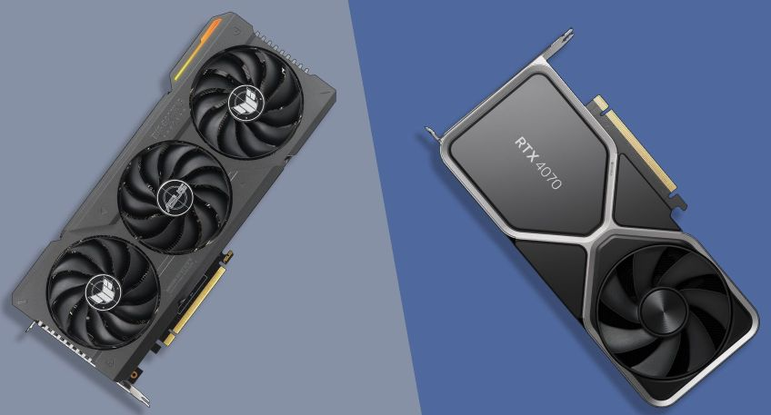
- **🔵 NVIDIA GeForce**
  - Known for stability, ray tracing, DLSS (Deep Learning Super Sampling), and wide support.
  - Popular series: GTX, RTX (e.g., RTX 3060, 4070 Ti).
- **🔴 AMD Radeon**
  - Strong price-to-performance ratio.
  - Offers technologies like FreeSync and FSR (FidelityFX Super Resolution).
  - Popular series: RX 6000, RX 7000.

> 💡 Some systems may also use **Intel Arc** (a newer discrete GPU line from Intel).

#### 🎯 What to Look For When Buying

When choosing a video card, consider:

- **Memory Size & Type:** GDDR5, GDDR6, or newer (affects speed and bandwidth).
- **Ports:** HDMI, DisplayPort, DVI, USB-C (depending on monitor compatibility).
- **Form Factor:** Will it physically fit in your case? Check length, width, and height.
- **Power Requirements:** Some GPUs need 6- or 8-pin power connectors; ensure your PSU can handle it.
- **Cooling Needs:** Active cooling (fans), passive cooling (heatsinks), or liquid cooling for high-end builds.
- **Resolution Support:** 1080p, 1440p, 4K gaming, or multi-monitor setups.

---

### 🎧 Multimedia Expansion Cards

#### 🔊 Sound Cards (Audio Interfaces)

A **sound card** is a hardware component responsible for processing audio signals. It converts **digital data** from your computer into **analog sound** that you can hear through speakers or headphones—and vice versa for recording.

##### 🎧 Functions of a Sound Card

- **Digital-to-Analog Conversion (DAC):** Converts digital audio into analog signals for playback.
- **Analog-to-Digital Conversion (ADC):** Converts analog input (like a microphone) into digital form for processing or recording.
- **Audio Processing:** Handles effects like reverb, equalization, and mixing without relying solely on CPU power.

##### 🧩 Types of Sound Cards

##### 1. **Integrated (Onboard) Sound**
- Built directly into most modern **motherboards**.
- Supports common configurations like:
  - **Stereo (2.0)**
  - **Surround sound (5.1 or 7.1)** for home theater systems.
- Usually features **3.5mm jacks**:
  - **Green** – Line-out (speakers/headphones)
  - **Pink** – Mic-in
  - **Blue** – Line-in
- Good enough for general users: music, video calls, light gaming.

##### 2. **Discrete (Add-on) Sound Cards**
- Installed via **PCIe** or USB.
- Designed for audiophiles, musicians, and content creators.
- Offer:
  - **Higher sampling rates** (e.g., 96kHz, 192kHz)
  - **Better bit depth** (e.g., 24-bit, 32-bit audio)
  - **Higher signal-to-noise ratio (SNR)** — often 100dB or more
  - **Dedicated DACs/AMPs** for enhanced audio fidelity

> 🎧 Ideal for: studio recording, gaming with 3D audio, surround systems, and lossless audio playback.

#### 🎹 MIDI Compatibility

**MIDI (Musical Instrument Digital Interface)** allows digital instruments like keyboards, drum pads, and controllers to communicate with computers or synthesizers.

- **Legacy MIDI:**
  - Used **5-pin DIN connectors**.
  - Often integrated into old sound cards via a **DA15 game port**.
  - Common in older studios and gaming rigs.

- **Modern MIDI:**
  - Uses **USB** connections.
  - Plug-and-play support in modern operating systems.
  - No special sound card required—MIDI data handled digitally.

> 🎵 Many musicians now use **USB MIDI controllers** with **DAWs** (Digital Audio Workstations) like FL Studio, Ableton Live, or Logic Pro.

#### 🎥 Video Capture Cards

- Record video streams for editing/sharing.
- Sources: Internet streams, cameras, smartphones.
- Can be **internal (PCIe)** or **external (USB)**.
- Not all capture cards record audio.
- Check:
  - **Audio support**
  - **Resolution compatibility**
  - **Bundled software**

### 🌐 Network Interface Cards (NICs)

A **Network Interface Card (NIC)** is a hardware component that allows a computer or device to connect to a network—either **wired** (Ethernet) or **wireless** (Wi-Fi). It plays a crucial role in enabling network communication by converting **internal parallel data** (used by the CPU and memory) into **serial data frames** suitable for transmission over network media.

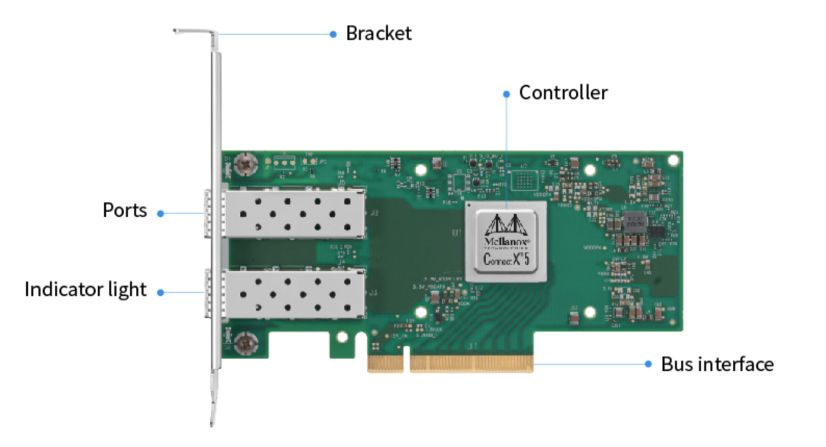
#### 🔧 Types of NICs

##### 1. **Internal NICs**
- Installed **inside** the system via:
  - **PCI** (older systems)
  - **PCI Express (PCIe)** — modern systems, high-speed interface
- Typically used in **desktop PCs** and **servers**
- May support **1 Gbps**, **2.5 Gbps**, **10 Gbps**, or more

##### 2. **External NICs**
- Connects via:
  - **USB 2.0 / 3.0 / USB-C**
  - **Thunderbolt (for Macs or high-performance systems)**
- Useful when:
  - Internal NIC is damaged or unavailable
  - Adding Wi-Fi or Ethernet to laptops/tablets

> 💡 **Driver Installation:** Most NICs require drivers to operate. Modern OSs often include built-in drivers, but for advanced features or latest hardware, downloading from the vendor's site may be necessary.

#### 📡 Wired vs. Wireless NICs

| 🔌 **Type**    | 🔗 **Interface / Port**              | 📝 **Description**                                  |
|---------------|--------------------------------------|-----------------------------------------------------|
| **Wired**     | RJ-45 (Ethernet), Fiber (SFP), Coax  | Fast and stable. Common in desktops, servers.       |
| **Wireless**  | Antenna, Mini PCIe, USB Wi-Fi        | Allows mobility. Needs wireless AP or router config.|

##### 🧰 Wired NIC Features:
- Uses **Ethernet standards** (e.g., 100BASE-TX, 1000BASE-T, 10GBASE-T)
- Connects to switches, hubs, routers, or modems
- Offers **lower latency**, **higher reliability**, and **faster transfer speeds**
- Ideal for gaming, media streaming, file servers

##### 📶 Wireless NIC Features:
- Supports **IEEE 802.11** standards (e.g., 802.11ac, 802.11ax/Wi-Fi 6)
- Includes **internal** or **external antennas** for signal strength
- Can connect to Wi-Fi networks from access points, hotspots, or routers
- Offers **mobility**, but may face interference or range issues

#### 🏷️ Common NIC Brands and Chipsets

- **Intel** – Known for high-performance wired NICs (often used in servers)
- **Realtek** – Common in budget motherboards and USB adapters
- **Qualcomm Atheros** – Often found in wireless NICs
- **Broadcom** – Enterprise-grade NICs, especially in servers
- **TP-Link / ASUS / Netgear** – Consumer-friendly external NICs

---

### 🔌 Input/Output (I/O) Expansion Cards

An **Input/Output (I/O) expansion card** is a hardware component installed in a computer's expansion slot (typically **PCIe** or **older PCI**) to increase its connectivity options. These cards allow your system to interface with a broader range of **peripherals**, **storage devices**, and **external systems**, often adding capabilities not present on the motherboard.

#### 🔧 Common I/O Expansion Cards

| 🔌 **Card Type**         | 📝 **Description**                                                                 |
|--------------------------|-----------------------------------------------------------------------------------|
| ✅ **USB Expansion Cards**     | Adds more USB 2.0, 3.0, or 3.1 ports. Available in models with 2–7 ports. Ideal for systems with limited USB. |
| 📦 **Storage Cards (eSATA)**   | Add external SATA (eSATA) ports for connecting high-speed external drives. May also provide internal SATA. |
| ⚡ **Thunderbolt Cards**       | High-speed interface that supports data transfer, video output, and device daisy-chaining. Used for media workflows. |
| 🔗 **FireWire (IEEE 1394)**    | Legacy interface used in audio/video equipment, especially in video editing. Rare in modern systems. |
| 🎥 **Video Capture Cards**     | Allow video input from external sources (e.g., cameras, consoles) for recording or streaming. Common in content creation. |
| 🎧 **Sound Cards**             | Enhances audio capabilities; includes ports for speakers, microphones, and studio equipment. |
| 📡 **Wi-Fi/Bluetooth Cards**   | Adds wireless connectivity. Often includes antennas for better reception. Useful for desktops or upgrades. |

> 🧩 Some I/O cards are **combo cards**, offering multiple types of ports (e.g., USB + eSATA, or USB + FireWire).

#### 🛠️ Adapter Configuration: Plug and Play (PnP)

Most modern I/O expansion cards are **Plug and Play (PnP)**:
- Automatically detected by the operating system.
- Drivers are either preloaded or downloaded automatically.
- No need to configure jumpers or dip switches like older hardware.

However, **manual configuration** may be needed in some cases, especially for specialized or high-performance devices.

#### ⚙️ Special Cases That May Require Manual Configuration

| ⚙️ **Adapter Type**         | 🔧 **Manual Configuration Needs**                                                                    |
|----------------------------|--------------------------------------------------------------------------------------------------------|
| 🖥️ **SLI/CrossFire GPUs**        | Requires a **hardware bridge connector** between cards. Also needs BIOS and driver support.              |
| 🎧 **Advanced Sound Cards**     | May require vendor software to enable features like surround sound, EQs, or audio routing.               |
| 🎥 **Video Capture Cards**      | Basic capture may work with OS drivers, but full features need **third-party tools** or vendor apps.     |
| 📡 **Wireless NICs**            | Often include **removable antennas**; need Wi-Fi configuration and sometimes driver installation.        |
| 🔌 **Wired NICs**               | Might require manual IP setup, duplex mode, or speed settings in enterprise environments.                |
| 💾 **RAID Controller Cards**    | BIOS or software setup required to define RAID levels (0, 1, 5, 10, etc.) and initialize drives.         |

> 🧠 **Tip:** Always check the documentation or vendor support site for special configuration steps and tools.

#### 📝 Expansion Card Installation Checklist

Follow this step-by-step guide to install and configure your I/O expansion card safely:

1. ❌ **Power off** the computer and **unplug** it from the wall.
2. ⚡ **Discharge static electricity** (e.g., touch a metal surface).
3. 🧩 **Insert the card** into the correct slot (e.g., PCIe x1, x4, or x16).
4. 🔋 **Connect power** if required (common with GPUs or high-power cards).
5. 🔧 **Secure** the card to the case using screws or a retention bracket.
6. ⚙️ **Boot the system** and wait for the OS to detect the new hardware.
7. 💾 **Install drivers**:
   - May happen automatically via Plug and Play.
   - Or install manually from a provided CD or manufacturer website.
8. 🧭 **Check BIOS/UEFI settings** if the card isn't recognized.
9. 🧰 **Use vendor software/utilities** for advanced configurations or diagnostics.
---

## 💽  Understanding Storage Devices
- Hard Disk Drive (HDD) Systems
- Solid-State Drives (SSDs)
- RAID (Redundant Array of Independent Disks)
- Removable Storage and Media

### 💾 Hard Disk Drive (HDD) Systems

A **Hard Disk Drive (HDD)** is a non-volatile, magnetic storage device that provides **permanent storage** for operating systems, applications, and user data. It retains data even when powered off. While Solid-State Drives (SSDs) are increasingly common, HDDs remain relevant due to their **higher capacity-to-cost ratio**.

HDDs are typically **internal**, installed in desktop or server cases, but **external models** exist for backups, media storage, and portability.

#### ⚙️ Key Components

- **Controller**  
  - Manages disk operations, including motor control, head positioning, and data encoding/decoding.
  - Usually integrated into the drive itself (as a PCB board).

- **Hard Disk (Platters)**  
  - Circular magnetic disks where data is stored in concentric tracks.
  - Made of aluminum, glass, or ceramic coated with a magnetic layer.

- **Read/Write Heads**  
  - Hover just nanometers above the platter surface.
  - Use electromagnetic fields to read/write data.

- **Host Bus Adapter (HBA)**  
  - Converts between drive signals and the system’s communication protocol.
  - Often integrated into the **motherboard** (e.g., SATA controller), but **dedicated RAID or SAS HBAs** exist for servers.

#### 🔗 Interfaces (Connection Standards)

| Interface | Description                         | Speed         | Notes                          |
|-----------|-------------------------------------|---------------|--------------------------------|
| **SATA**  | Serial ATA, modern interface         | Up to 600 MB/s (SATA III) | Most common in consumer PCs. |
| **PATA**  | Parallel ATA, legacy interface       | Up to 133 MB/s (ATA/133)  | Obsolete, ribbon cable-based. |
| **SCSI**  | Small Computer System Interface      | 320 MB/s+     | Used in enterprise environments. |
| **SAS**   | Serial Attached SCSI                 | Up to 12 Gb/s | High-end servers and RAID systems. |
| **USB/FireWire/eSATA** | For external HDDs          | Varies        | Depends on enclosure/interface.|

#### 🛠️ Internal Structure (Anatomy of an HDD)

- **Platters**  
  - Spin at high speeds; data is stored magnetically.
  
- **Read/Write Heads**  
  - Move across platters via an actuator arm.
  
- **Tracks**  
  - Concentric circles where data is recorded.
  
- **Sectors**  
  - Smallest addressable storage units; typically 512 bytes or 4K in modern drives.
  
- **Cylinders**  
  - Vertically aligned tracks across multiple platters.
  
- **Clusters**  
  - Group of sectors defined by the file system. Larger clusters = fewer files but more wasted space (slack).

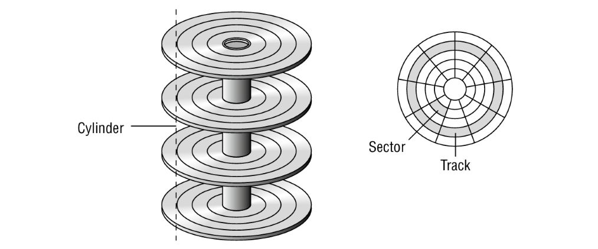
> 💡 **Zone Bit Recording (ZBR)** allows more sectors per track near the outer edge of platters, improving capacity.

#### 🌀 Spin Speeds (RPM – Revolutions Per Minute)

| 🔄 RPM         | 💻 Typical Usage                  |
|----------------|----------------------------------|
| **5,400 rpm**  | Energy-efficient laptops, backups |
| **7,200 rpm**  | Standard desktop drives           |
| **10,000 rpm** | Performance desktops/workstations |
| **15,000 rpm** | Enterprise, servers (rare today)  |

- Higher RPM = **faster data access**, but also **more noise**, **heat**, and **power consumption**.
- SSDs outperform even the fastest HDDs due to **zero mechanical latency**.

#### 📏 Form Factors
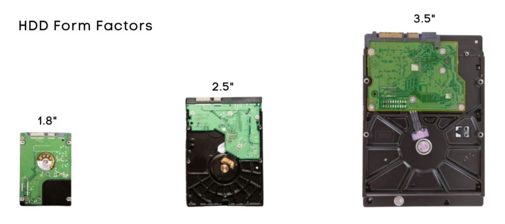
| 📐 Size   | 🧰 Use Case              |
|----------|--------------------------|
| **3.5"** | Desktop computers         |
| **2.5"** | Laptops, external drives  |
| **1.8"** | Ultraportables (obsolete) |

> 🧠 Note: While 2.5" HDDs were common in laptops, they're being rapidly replaced by 2.5" or M.2 form factor SSDs.

#### 🧪 Manufacturing and Reliability

- Manufactured in **cleanroom environments** to prevent contamination.
- Internals are **air-sealed** but not vacuum-sealed; they equalize pressure via tiny filters.
- Fragile when powered (moving heads); **dropping an active HDD can cause head crash** and permanent data loss.

#### 🧰 Formatting and Initialization Stages

1. **Low-Level Formatting**  
   - Performed at the factory. Defines tracks, sectors, and sector boundaries.
  
2. **Partitioning**  
   - User-defined layout of disk space (MBR, GPT).
  
3. **High-Level Formatting**  
   - Applies a **file system** (FAT32, NTFS, ext4) and initializes clusters.
  
4. **Logical Block Addressing (LBA)**  
   - Modern OSes use LBA instead of CHS (Cylinder-Head-Sector) for addressing storage.

#### 🧭 BIOS/UEFI & Controller Roles

- BIOS/UEFI uses **drive geometry translation** to access the drive properly.
- Modern systems use **AHCI or NVMe** protocols (for SSDs) to optimize storage performance.
- RAID controllers (software or hardware) manage multiple drives for performance or redundancy.

---

### 🖴 Solid-State Drives (SSDs)

#### ✅ Advantages
- ⚡ Faster start-up and read/write times
- 🔋 Lower power consumption and less heat
- 🔇 Silent operation
- 🔧 More reliable (no moving parts)
- 🧱 Shock-resistant
- 📏 Higher data density

#### ❌ Disadvantages
- 💰 Higher cost per GB than HDDs
- ♻️ Limited write cycles (wear over time)
- 📦 Lower storage capacities than HDDs (max ~8TB consumer vs. 18TB+ for HDDs)

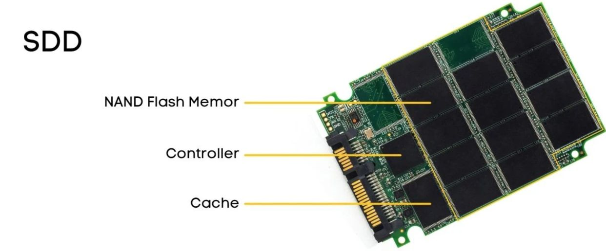

##### 💡 Notes
- SSDs retain data across power cycles.
- DRAM caching can enhance SSD speed.
- Available in various shapes, sizes, and interfaces.

#### 🔀 Hybrid Drives

##### 🔹 Solid-State Hybrid Drive (SSHD)
- HDD with built-in flash storage.
- Appears as one drive to OS.
- Caches frequently used data automatically.

##### 🔸 Dual-Drive Setup
- Separate HDD + SSD.
- User or software controls what gets cached to SSD.
- Requires configuration but offers more control.

###### ⚠️ Limitations
- No speed benefit for random/first-time data access.
- Performance improves with repeated access.

#### 🔌 SSD Communication Interfaces

##### 1. 🧩 SATA (Serial ATA)
- Used with both HDDs and SSDs.
- Versions:
  - SATA I: 150 MBps
  - SATA II: 300 MBps
  - SATA III: 600 MBps
- ⚠️ Slowest among SSD interfaces but still ~6× faster than HDDs.
- ✅ Cheap and widely supported.

##### 2. 🚀 PCIe (Peripheral Component Interconnect Express)
- High-speed interface using dedicated lanes (x1, x4, x8, x16).
- Throughput depends on version and lane count:
  - PCIe 2.0 x4 ≈ 4 GBps max
  - Real-world speeds vary due to hardware limitations.
- ✅ Much faster than SATA.
- ❗ Not all motherboards support booting from PCIe SSDs.

##### 3. ⚡ NVMe (Non-Volatile Memory Express)
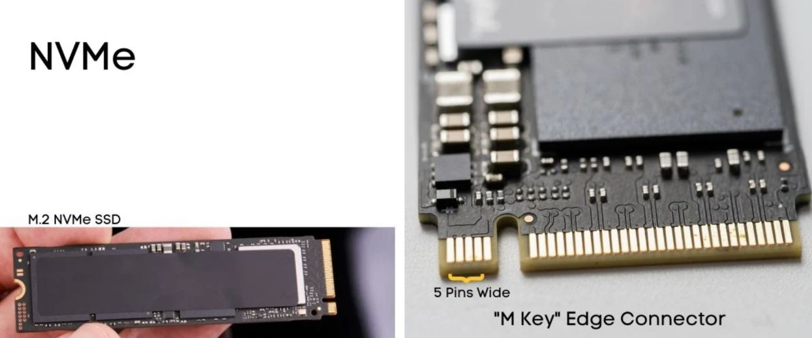
- A protocol, not a connector.
- Designed for high-speed SSD communication over PCIe/M.2.
- Max speeds: up to ~3.5 GBps+
- ✅ Optimized for flash storage.
- ❗ Requires BIOS/motherboard support for booting.

###### 💡 Key Reminder
- NVMe on SATA is still limited to SATA's 600 MBps cap.
- BIOS must support NVMe for boot drives (especially with add-in PCIe cards).

#### 🧩 SSD Form Factors
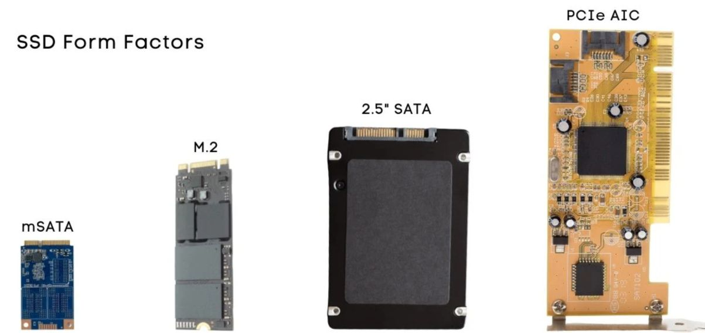
Form factors define the **physical size and shape** of SSDs, **not** how they communicate.  
Common form factors to know for the A+ exam:

##### 🔹 mSATA (Mini-SATA)
- Introduced: 2009 (SATA 3.1)
- Designed for: Small devices like laptops
- Uses: SATA interface
- Connector: 52-pin, 30mm wide (same as mPCIe)
- Sizes:
  - Full-size: 30mm × 50.95mm
  - Half-size: 30mm × 26.8mm
- mSATA and mPCIe cards share **physical dimensions** but use **different wiring**:
  - mSATA → SATA protocol (storage only)
  - mPCIe → PCIe protocol (network, cellular, etc.)
- 📚 Always check **motherboard documentation** to verify slot compatibility.

##### 🔸 M.2 (NGFF – Next Generation Form Factor)

- Successor to mSATA
- Supports: **SATA**, **PCIe**, and **USB** buses
- Used for: SSDs, Wi-Fi, Bluetooth, GPS, NFC
- Connector: 66-pin, 22mm wide
- Pronounced: "M dot 2"
- **Prevents wrong card installation**
- Keys determine function and compatibility:
  - **A** / **E** → Wi-Fi/Bluetooth cards
  - **B** → Up to PCIe x2
  - **M** → Up to PCIe x4 (fastest)
  - **B+M** → Compatible with either B or M slots, but not full x4 speed

###### 🔢 Sizing Convention
- Format: `[Width][Length]` in mm  
  Examples:
  - `2242`: 22mm wide × 42mm long
  - `2280`: 22mm × 80mm (very common)
  - `22110`: 22mm × 110mm

###### 💡 Performance Notes
- **M.2 SATA SSD**:
  - Limited to **600 MBps** (same as SATA III)
- **M.2 PCIe SSD**:
  - Uses PCIe lanes for **faster speeds**
  - With NVMe: can reach **3.5 GBps+**
- 🔧 M.2 NVMe = Best performance (if motherboard supports it)

##### 🧷 Physical Installation
- Motherboards may include:
  - **Keyed slots** (E, B, M)
  - **Mounting screws** for different lengths (42mm, 60mm, 80mm, 110mm)
  - **Covers** for protection and stability

##### 📸 Visual Size Comparison
From largest to smallest:
1. 2.5" SATA SSD (traditional)
2. Full-size mSATA
3. M.2 22110
4. M.2 2280

| Feature        | mSATA                  | M.2 (NGFF)           |
|----------------|------------------------|-----------------------|
| Introduced     | 2009                   | ~2013                |
| Interface      | SATA                   | SATA, PCIe, USB      |
| Connector      | 52-pin, 30mm wide      | 66-pin, 22mm wide    |
| Typical Uses   | Storage only           | SSD, Wi-Fi, Bluetooth|
| Keying         | None                   | A, B, M, B+M, etc.    |
| Max Speed      | ~600 MBps              | Up to 3.5 GBps (NVMe)|
| Common Sizes   | 30×26.8mm, 30×50.95mm  | 2242, 2260, 2280, etc.|

### 🧠 RAID (Redundant Array of Independent Disks)

RAID is a **technology** that combines multiple drives to improve:
- 📈 **Performance** (faster reads/writes)
- 🛡️ **Fault tolerance** (survives drive failure)

🛠️ **RAID Types**:
- **Hardware RAID**: Built into motherboard or RAID controller (faster, more expensive)
- **Software RAID**: Managed by OS (cheaper, lower performance)

| Feature       | Description                          |
|---------------|--------------------------------------|
| 🔁 Nickname   | Disk Striping                        |
| 🧩 Min. Drives| 2                                    |
| 🛡️ Fault Tolerance | ❌ None                           |
| ⚡ Performance | ✅ High (reads/writes split across drives) |
| 💾 Capacity   | Combined space of all drives         |
| 💣 Risk       | One drive fails = **all data lost**  |

➡️ *Use only when performance is critical and backups are elsewhere.*

#### 🪞 RAID 1 — **Mirroring**

| Feature       | Description                          |
|---------------|--------------------------------------|
| 🔁 Nickname   | Disk Mirroring                       | 
| 🧩 Min. Drives| 2                                    |
| 🛡️ Fault Tolerance | ✅ High (exact copy on 2nd drive) |
| ⚡ Performance | ❌ No gain (writes duplicated)       |
| 💾 Capacity   | 50% of total (one drive’s space)     |
| 💡 Duplexing  | Uses two host adapters               |

➡️ *Simple and reliable for critical data. Most common for fault tolerance.*

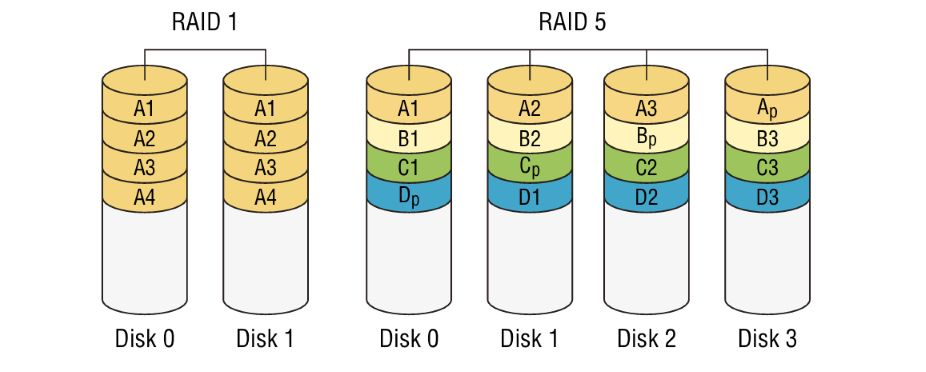
#### 🧮 RAID 5 — **Striping with Parity**

| Feature       | Description                               |
|---------------|-------------------------------------------|
| 🔁 Nickname   | Stripe Set with Parity                    |
| 🧩 Min. Drives| 3                                         |
| 🛡️ Fault Tolerance | ✅ High (can survive 1 disk failure)   |
| ⚡ Performance | ✅ Read: Good / Write: Moderate           |
| 💾 Capacity   | Total space - 1 drive                     |

🧠 *Parity (error-checking math) is **spread** across all drives.*

➡️ *Most balanced RAID — good fault tolerance + efficient use of space.*

#### 🧩 RAID 10 — **RAID 1 + 0 (Nested RAID)**

| Feature       | Description                                 |
|---------------|---------------------------------------------|
| 🔁 Nickname   | Mirrored Stripes                            |
| 🧩 Min. Drives| 4                                           |
| 🛡️ Fault Tolerance | ✅ Very High (each stripe is mirrored)    |
| ⚡ Performance | ✅ High (fast read/write & redundancy)       |
| 💾 Capacity   | 50% of total (mirrored pairs)               |

➡️ *Ideal for performance-critical and fault-tolerant environments.*

##### 🔒 RAID Summary Table

| RAID | Nickname       | Min Disks | Redundancy | Performance | Usable Space | Notes                           |
|------|----------------|-----------|------------|-------------|---------------|----------------------------------|
| 0    | Striping        | 2         | ❌ None     | ✅ Very High | 100%          | No protection, fast, risky       |
| 1    | Mirroring       | 2         | ✅ Yes      | ❌ No Gain   | 50%           | Simple, secure, expensive        |
| 5    | Striping + Parity| 3        | ✅ Yes (1)  | ✅ Balanced  | ~66–80%       | Most efficient + safe            |
| 10   | Mirrored Stripes| 4         | ✅ Yes      | ✅ Very High | 50%           | Best of both worlds              |

### 💾 Removable Storage and Media

Removable storage allows users to **add or remove** storage devices **without opening the computer**. These are essential for:
- 🔄 Transferring files
- 📦 Backups
- 💥 Disaster recovery
- 🧪 Testing & troubleshooting

#### 🔋 Flash Memory

Flash memory is **nonvolatile** (retains data without power) and is used in both internal and external devices.

##### 🔌 Common Uses
- BIOS chips
- Embedded systems (e.g., routers)
- USB drives
- Memory cards
- SSDs

📌 **Cisco devices** store IOS in flash memory:
- **Accessed at boot** (and sometimes during operation)
- Often **compressed**, then loaded into RAM

##### 🧠 USB Flash Drives

| Feature          | Details |
|------------------|---------|
| 🧳 Portability    | Tiny size, easy to carry (keychains, etc.) |
| 🔄 Interface      | USB (supports Plug & Play, AutoPlay, Safe Removal) |
| 💽 File Access    | Shows as removable drive with a letter in File Explorer |
| ⚠️ Disk Mgmt Tip | Sometimes needs manual drive letter assignment in **Disk Management** |

##### 🗂️ SD and Memory Cards

Used in **cameras**, **phones**, **printers**, and more.

###### 📐 Common Formats

| Type       | Size (mm)      | Notes                            |
|------------|----------------|----------------------------------|
| SD         | 32 × 24        | Most common, has write-protect switch |
| miniSD     | 21.5 × 20      | Smaller, uses adapter            |
| microSD    | 15 × 11        | Smallest, used in phones         |
| MMC        | 32 × 24        | Older than SD, no write-protect  |

📌 Adapters allow **microSD** or **miniSD** to fit standard SD slots.

🖨️ Devices like **HP PhotoSmart printers** have multi-format card readers:
- CF/Microdrive
- SmartMedia
- Memory Stick
- MMC/SD

##### 🧲 External Card Readers

If your PC lacks a memory card slot:
- 🔌 Use **USB-based** external card readers
- 💡 Many support **multiple formats** in one unit

#### ♨️ Hot, Warm, and Cold Swappable Devices

| Term               | Meaning |
|--------------------|---------|
| 🔥 **Hot-swappable**  | Can plug in/out **while system is powered ON** without damage |
| ♨️ **Warm-swappable** | Requires software dismount (e.g., Safe Removal) before unplugging |
| ❄️ **Cold-swappable** | Must **power off the system** before inserting/removing |

##### 🔌 Examples

| Device Type                    | Category           |
|-------------------------------|--------------------|
| USB flash drive (with FS)     | Warm-swappable     |
| USB flash (no filesystem)     | Hot-swappable      |
| SATA drive (internal)         | Cold-swappable     |
| RAID drives with SCA          | Hot-swappable      |

##### 🧷 SCA (Single Connector Attachment)

Used in **hot-swappable RAID systems**:
- 🔗 Combines **power and data** into one connector
- 🛡️ Ground leads connect first → prevents damage
- 🔄 Similar protection in **SATA power connectors**

#### 💿 Optical Drives & Media

- Optical drives use **lasers** to read/write data on **spinning discs**.
- They **do not** use magnetic fields (unlike HDDs).
- Common formats: **CD, DVD, Blu-ray (BD)**.
- Decreasing popularity due to streaming and solid-state media.

#### 🧠 Generations of Optical Discs

##### 1️⃣ Compact Disc (CD)
- 📦 Capacity:
  - Standard: **650–700 MB**
  - Extended: **800–900 MB**
- 🔍 Laser: **Infrared** (780 nm)
- 🧱 Structure: Single-sided, single-layer
- 📝 Usage: Audio, software, light data storage

##### 2️⃣ Digital Versatile Disc (DVD)
- 📦 Capacities:
  - **4.7 GB** – Single-sided, single-layer (DVD-5)
  - **8.5 GB** – Single-sided, dual-layer (DVD-9)
  - **9.4 GB** – Double-sided, single-layer (DVD-10)
  - **17.1 GB** – Double-sided, dual-layer (DVD-18)
- 🔍 Laser: **Red** (650 nm)
- 🧱 Layering: Multiple sides and/or layers
- 📝 Usage: Video, backups, software distribution

##### 3️⃣ Blu-ray Disc (BD)
- 📦 Capacities:
  - **25 GB** – Single-layer
  - **50 GB** – Dual-layer
- 🔍 Laser: **Violet/Blue** (405 nm)
- 📏 Size: Same 12 cm diameter as CDs/DVDs
- 📝 Usage: HD/4K video, high-capacity storage

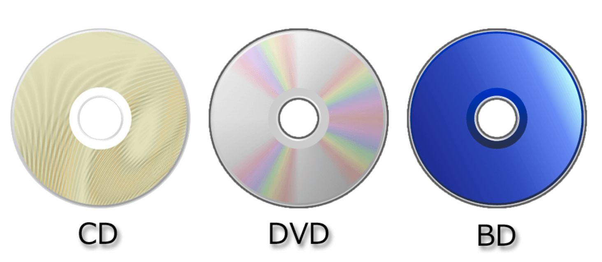
##### 🚀 Optical Drive Speeds

| Format | 1X Speed        | Common Speeds       |
|--------|------------------|---------------------|
| CD     | 150 KB/s         | Up to 52X           |
| DVD    | 1.4 MB/s         | Up to 24X           |
| Blu-ray| 4.5 MB/s         | 2X (playback), 16X+  |

- 💡 Speed increases were achieved by improving **spin rate**, **buffering**, and **laser control**.

##### 🔥 Recordable vs. Rewritable Discs

###### CD Formats:
- **CD-R** → Recordable once
- **CD-RW** → Rewritable multiple times

###### DVD Formats:
- **DVD-R / DVD+R** → Recordable once
- **DVD-RW / DVD+RW** → Rewritable
- 🔁 Two standards exist: DVD Forum (`-`) vs DVD+RW Alliance (`+`)

###### Blu-ray Formats:
- **BD-R** → Recordable
- **BD-RE** → Rewritable

| Type       | Layers/Sides       | Capacity     |
|------------|---------------------|--------------|
| CD         | 1 layer, 1 side     | 650–900 MB   |
| DVD-5      | 1 layer, 1 side     | 4.7 GB       |
| DVD-9      | 2 layers, 1 side    | 8.5 GB       |
| DVD-10     | 1 layer, 2 sides    | 9.4 GB       |
| DVD-18     | 2 layers, 2 sides   | 17.1 GB      |
| BD-SL      | 1 layer             | 25 GB        |
| BD-DL      | 2 layers            | 50 GB        |

---

## 🔌 Understanding Power Supplies

### ⚡️ What Does a Power Supply Do?

A **power supply unit (PSU)** converts **AC power (110V or 220V)** from a wall outlet into **DC voltages** required by the computer:
- +3.3VDC
- +5VDC
- –5VDC (older systems)
- +12VDC
- –12VDC

🎨 Color-coded wires help identify voltages, and black wires are ground (reference point).

### 🧮 Electrical Basics

To better understand electricity in computers:

| Term     | Analogy            | Definition                                  |
|----------|--------------------|---------------------------------------------|
| 🔋 Amps  | Water flow         | Amount of electrical current                |
| 🚰 Volts | Water pressure     | Electrical force                            |
| ⚙️ Watts | Power output       | Volts × Amps                                |
| 🧱 Ohms  | Resistance in pipe | Resistance to electrical flow               |

### 🔌 Power Supply Input

- Power is sourced from a **wall outlet** 🔌.
- May pass through a **UPS (Uninterruptible Power Supply)** 🔋 first.
- PSUs do **not generate** power — they **convert** AC ➡️ DC.

#### 🌍 Global Voltage Standards

- **USA**: 110V–120V ⚡
- **Europe**: 220V–240V ⚡

💡 Many PSUs include a **voltage selector switch** (e.g., 110/220, 115/230) to match the country’s standard.

> ⚠️ **Warning:**  
Incorrect voltage setting can cause:
- Computer failing to power up (under-voltage)
- Damage/fire risk (over-voltage)

✅ Always double-check the voltage switch before powering on a system — especially when moving it between countries.

### ⚙️ Power Supply Output & Ratings

#### 🔀 Power Rails

Each output voltage from a power supply is known as a **rail**:
- +3.3V
- +5V
- +12V

🔧 Some PSUs have **multiple 12V rails** to distribute power:
- 🧠 One rail may be dedicated to the **CPU**
- 💻 Another for **other components**

> ⚠️ **Caution:**  
Multi-rail setups can shut down if one rail is overloaded — even if total power is within limits. Always **balance the load** across rails.

#### 🔢 Wattage Ratings

Power supplies are rated in **watts (W)** — a measure of total power output:
- 🔋 **Typical systems:** 350W–500W
- 🎮 **High-performance systems:** 750W–900W
- 🚀 **Extreme builds:** Up to 2000W (yes, really!)

💡 **More watts = more capacity** to support:
- Power-hungry GPUs 🎮
- Multiple HDDs/SSDs 💾
- Overclocked CPUs ⚡

> 🧠 **Pro Tip:**  
Choose a PSU based on the total **power draw** of all your components. A weak PSU = system instability or shutdowns.

---
### 🔌 Power Connectors

Modern PSUs come with various connector types:
- 🔧 **Fixed connectors** (always attached)
- 🧲 **Modular connectors** (attach only what you need)

### 🧩 ATX, ATX12V & EPS12V

- **🔌 ATX 20-pin**: Original main connector (+3.3V, +5V, +12V)
- **🧠 P4 (4-pin)**: Delivers +12V to the CPU (added with Pentium 4)
- **⚙️ EPS12V (8-pin)**: Extended version for servers/CPUs
- **🔗 20+4 pin**: Flexible connector for both 20-pin and 24-pin motherboards
- **🔌 ATX12V 2.0+**: Introduyced 24-pin connector (needed for PCIe devices)

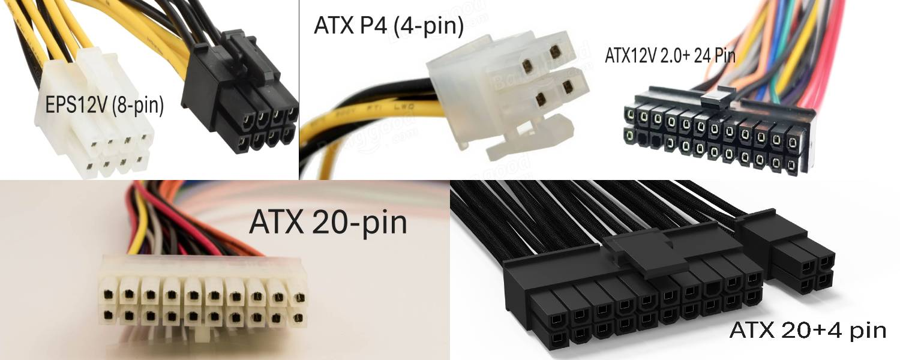
> 💡 6-pin auxiliary connector was dropped after ATX12V 2.0.

### 🎮 PCIe Power Connectors

- **6-pin PCIe**: Provides 75W for graphics cards
- **8-pin PCIe**: Provides 150W (added in ATX12V 2.2)
- 🧷 Includes plastic bridges and keying to prevent incorrect connections

### 🔐 Proprietary Power Connectors

Some brands (💻 e.g. Dell, HP) use **non-standard connectors**:
- Same voltages, different layouts
- ❌ Incompatible with generic parts
- ⚠️ Makes upgrades/replacements tricky

#### 💽 SATA Power Connectors

- **15-pin SATA power**: Supplies:
  - 3 × +3.3V (often omitted)
  - 3 × +5V
  - 3 × +12V
  - 6 × Grounds

🔄 SATA drives may also accept:
- **Molex connectors** (via adapters)
- Useful when 3.3V is not needed

### 🧩 Modular Power Supplies

Traditional (non-modular) PSUs came with **all cables permanently attached**, leading to:
- 😵‍💫 Cable clutter
- ❌ Unused connectors taking up space
- 🪢 Need for zip ties or cable organizers

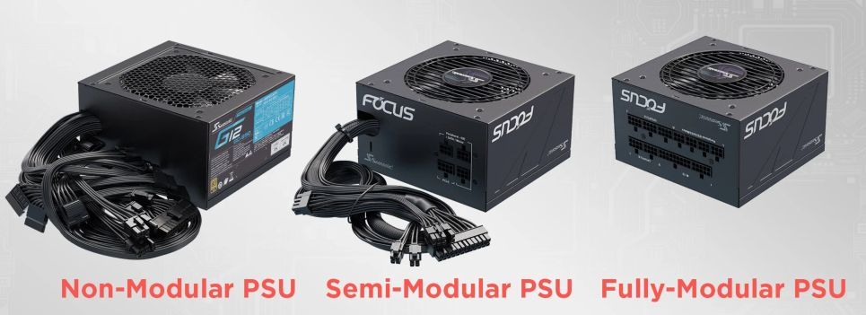

#### 🔗 Modular PSUs: The Clean Solution

- 🔌 **Fully Modular**:
  - No cables attached by default
  - Connect only the cables you need
  - Easier cable management and airflow
- ⚙️ **Semi-Modular**:
  - Motherboard and CPU cables are fixed
  - Other cables (PCIe, SATA, etc.) are modular

#### 📉 Potential Downsides

1. **🔐 Proprietary Connectors**  
   - Some brands use non-standard ports  
   - ⚠️ Keep all included cables!

2. **📏 Space Issues**  
   - Modular connectors add ~¼ to ½ inch to PSU depth  
   - Might be tight in **small form factor** (SFF) cases

---

### 🔁 Multiple PSUs (Redundant Power Supply - RPS)

Used mostly in servers, not desktops or laptops.

- 🧠 Purpose: If one PSU fails, the other takes over automatically.
- ⚡️ Seamless failover keeps systems running.
- 🔄 Typically comes as two PSUs in a single unit.
- 🔌 Compliant with ATX12V & EPS12V standards.
- 🔥 Hot-swappable: faulty unit can be replaced without shutdown.
- 🚫 Does **not** protect against power outages.

### 🔋 Battery Backup Systems (Uninterruptible Power Supply - UPS)

Keeps systems running temporarily during power outages.

- 🔌 Acts as both surge protector and battery backup.
- 🧱 Comes in sizes from small bricks to full server rack units.
- 🔢 Some models include LCDs and management software.
- 🔧 Supplies backup power to selected outlets.
- 🛡️ Protects against surges, sags, and outages.
- ⏱️ Allows time to safely shut down systems.
- 🔁 Periodically test and replace the battery (every 2–3 years).

✅ Essential for server environments, optional for home PCs.

---

